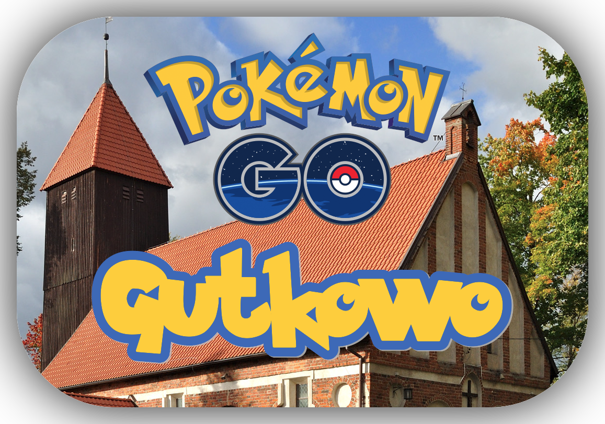

# PokeGutkowo

Aplikacja mająca na celu zrzeszenie gutkowiańskich graczy PokemonGO.
*Cii, mam fobię społeczną i pewnie jej nigdy nie użyję, ale może się uda XD*

### Wymagania:
* Python 3.7
* Django 2.1.1

### Testowane:
* Arch Linux / PyCharm